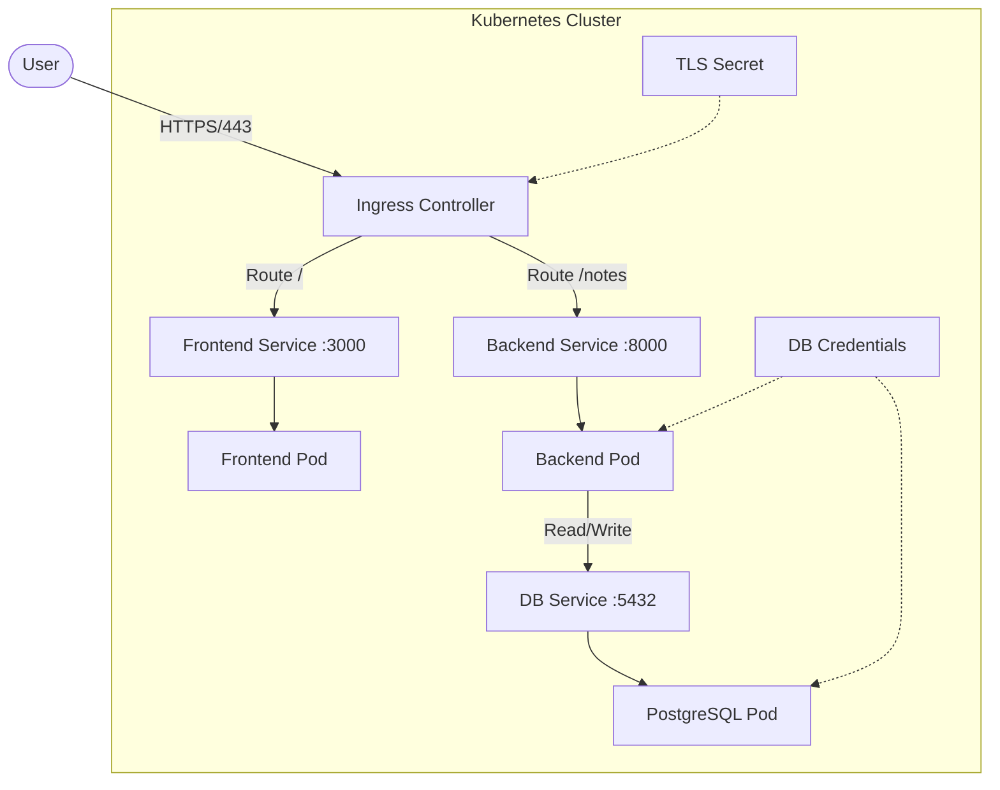

# Notes App Infrastructure

Professional Infrastructure-as-Code (IaC) project managing a microservices-based Note Application on Kubernetes using Terraform and Minikube.

## 🏗 Architecture

The system consists of a Frontend (Nginx/HTML), Backend (Python/FastAPI), and a PostgreSQL Database. All components are containerized and orchestrated by Kubernetes, with Minikube as the local development cluster.



### Components
*   **Frontend**: Nginx serving static assets, listening on port 3000.
*   **Backend**: Python API, listening on port 8000.
*   **Database**: PostgreSQL with persistent storage.
*   **Ingress**: Nginx Ingress Controller managing external access with TLS termination.
*   **Automation**: Terraform manages the entire lifecycle (Image Build -> K8s Resources).

## 🚀 Getting Started

### Prerequisites
*   [Terraform](https://www.terraform.io/)
*   [Minikube](https://minikube.sigs.k8s.io/)
*   [Docker](https://www.docker.com/)
*   [kubectl](https://kubernetes.io/docs/tasks/tools/)

### Usage

This project uses a `Makefile` to simplify operations.

1.  **Initialize the Environment**
    ```bash
    make install  # Check dependencies
    make init     # Initialize Terraform
    ```

2.  **Deploy Application**
    This command will build Docker images, load them into Minikube, and apply Kubernetes manifests.
    ```bash
    make up
    ```

3.  **Access the Application**
    
    **Option A: Direct Port Forwarding (Recommended for Dev)**
    Maps local ports to the services.
    ```bash
    make forward
    ```
    - Frontend: http://localhost:3000
    - Backend: http://localhost:8000
    
    **Option B: Ingress (HTTPS)**
    To use the secure ingress with TLS:
    
    **Terminal 1** (keep running):
    ```bash
    make hosts            # Configure /etc/hosts (one-time setup)
    make ingress-forward  # Start port forwarding
    ```
    
    **Browser**:
    - Frontend: https://notes-app.local:8443
    - Backend API: https://notes-app.local:8443/notes
    
    The Ingress is configured with a **Self-Signed Certificate**. You will need to accept the security warning in your browser.

4.  **Clean Up**
    Destroys all resources.
    ```bash
    make clean
    ```

## 🔐 Security & Network
*   **TLS/SSL**: Self-signed certificates are automatically generated by Terraform and mounted to the Ingress.
*   **Ports**:
    *   Frontend: 3000 (Container & Service)
    *   Backend: 8000
    *   Postgres: 5432 (Internal)
